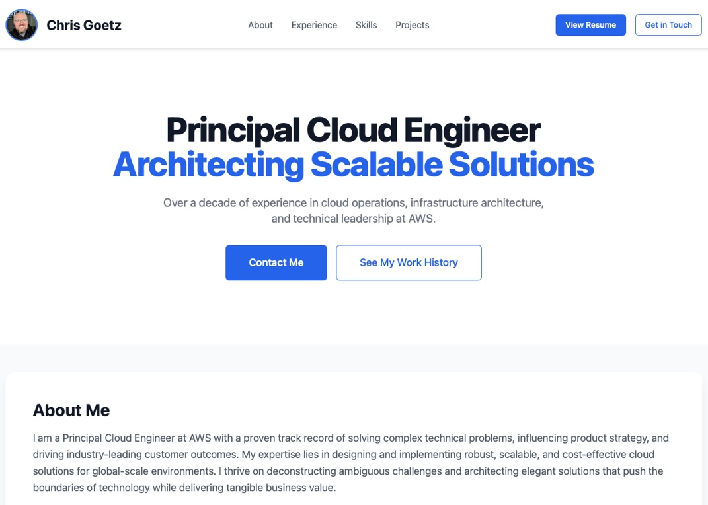

# Chris Goetz - Personal Portfolio & Resume

This repository contains the source code for my personal portfolio website, designed to serve as a professional landing page for recruiters and hiring managers. The site showcases my skills, experience, and projects in a clean, modern, and easily scannable format.

[](https://christopherg.github.io/)

[**View the Live Site &rarr;**](https://christopherg.github.io/)

---

## Features

-   **Recruiter-Focused Design:** The layout and content are optimized to provide a clear overview of my professional background for hiring purposes.
-   **Modern & Responsive:** Built with Tailwind CSS for a fully responsive experience across desktops, tablets, and mobile devices.
-   **Interactive Elements:** Smooth scroll animations and a timeline-style experience section for an engaging user experience.
-   **Downloadable Resume:** Includes a direct link to a professionally typeset PDF version of my resume.
-   **Rich Link Previews:** Optimized with Open Graph and Twitter Card meta tags for professional previews when shared on social media and messaging apps.

## Built With

-   **HTML5**
-   **Tailwind CSS**
-   **JavaScript**
-   **LaTeX** - For professional PDF resume generation.

## Development

The site is hosted directly on GitHub Pages. Any push to the `main` branch will automatically update the live site.

To generate the PDF resume from the LaTeX source, you will need a TeX distribution (like MacTeX) installed. You can then run:

```bash
xelatex ChrisGoetz_CV.tex
```

This will produce the `ChrisGoetz_CV.pdf` file. 